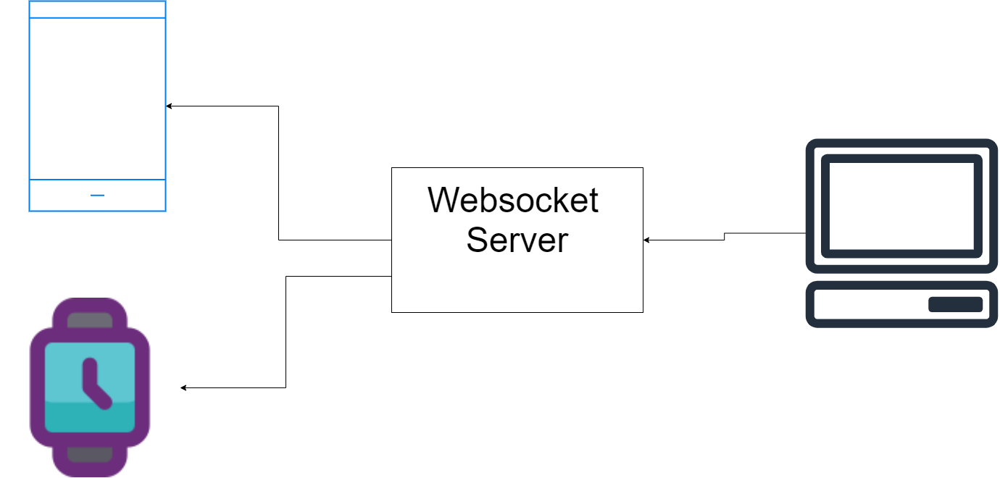

# Problem statement

In today's era, the experience of people can be improved with technology. One such area is the ability to control 3D objects on desktops or laptops using mobile and smartwatches. This ability can also be extended to enhance user gameplay experience by providing them the experience of the virtual joystick to control rotation and motion objects in a game like 3d maze etc

Traditionally users make use of a mouse or keyboard to control objects, which is a less immersive experience than having smartwatches or mobile phones do the same. Therefore, there is a need to develop an app that can use the accelerometer and gyroscopic data from mobile and smartwatch sensors to control the rotation and motion of 3D objects on desktops or laptops.

# Design

1. User Interface:
   - The app should provide a user-friendly interface for both smartwatch and Android app
   - Users can use their mobile device or smartwatch movements to rotate, move, or manipulate the 3D objects in real time.
   - The main screen should display options to connect using the IP address of the server and a following screen allowing the user to enter the IP address
   - A connect button is to establish a web socket connection to the server and a start button to collect data from sensors and sending over to the server
2. Sensor Data :
   - The app should utilize the accelerometer and gyroscopic sensors of the connected mobile device and smartwatch to collect real-time motion data.
3. Communication:
   - The app should establish a wireless connection between the mobile device or smartwatch and the server (running locally) on the desktop using web socket connections
   - The server will send this data to the fronted application (running on desktop)to display the motion and rotation of objects
4. Data Processing :
   - The data should be processed at the front end to extract meaningful information about the mobile or smartwatch movements.



# Implementation

1. SmartWatch/Mobile App:
   - The app was built using the open-source UI software development kit Flutter
2. Sensor Data :
   - Flutter plugin `sensors` are used to access the accelerometer and gyroscope sensors on the device.
3. Communication:
   - To establish a wireless connection between the Flutter app running on the mobile device or smartwatch and the desktop web socket is used
   - As the application is running local server and client should be connected to the same network
4. 3D Object Control:
   - The received data on the web client is used to manipulate the position, velocity, and orientation of 3d objects made in three js

# Usage

1. Controlling 3D Objects:

   The above app helps users to provide an immersive experience by making their device a controller that rotates and moves objects in real time wirelessly. It can be used for designers in 3d objects design software like Blender

2. Playing Game:

   Using the app a user can convert his/her smartwatch or mobile phone into a virtual joystick and controller that can be incorporated with games providing a better experience
   Game Credits:https://youtu.be/bTk6dcAckuI

# Run Locally

### Backend Server

Ensure that you have Node.js installed on your machine. You can download and install the latest LTS version of Node.js from the official Node.js website ([https://nodejs.org](https://nodejs.org/)).

1. Navigate to the Backend Directory:
   - Use the `cd` command to navigate to the directory where the Node.js server code is located.
     ```
     cd backend
     ```
2. Install Dependencies:
   - Run the `package.json` file, to install dependencies. Run the following command in the terminal to install the dependencies:
     ```bash
     npm install
     ```
3. Install Nodemon Globally:
   - To install nodemon globally, run the following command:
     ```bash
     npm install -g nodemon
     ```
4. Start the Server with Nodemon:
   - Start the server using nodemon. Run the following command in the terminal:
     ```bash
     nodemon server.js
     ```
5. Verify the Server:

   - You will see the following lines in the terminal

   ```bash
   [nodemon] 2.0.22
   [nodemon] to restart at any time, enter `rs`
   [nodemon] watching path(s): *.*
   [nodemon] watching extensions: js,mjs,json
   [nodemon] starting `node server.js`
   Listening on port 8000
   ```

### Frontend

Open the following link in the browser [`http://127.0.0.1:5500/Frontend/index.html`](http://127.0.0.1:5500/Frontend/index.html)

You can open it using LiveServer also.

### Mobile/SmartWartch app

1. Navigate to the app_client Directory:

```
cd app_client
```

1. Install Dependencies:
   - Run the following command in the terminal to install dependencies specified in the `pubspec.yaml` file
     ```
     flutter pub get
     ```
2. Connect a Device:
   - Connect an Android or iOS device to your computer using a USB cable or ensure that an emulator/simulator is running.
3. Start the App:
   - To start your Flutter app on the connected device run the following command in the terminal
     ```
     flutter run
     ```
